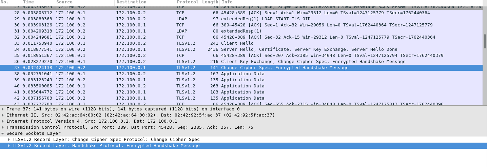

% Sistema RADIUS per l'autenticació de dispositius de xarxa <br> 
% Arnau Esteban Contreras - isx47590131
% 23/05/2018 - @edt

---

# ÍNDEX

1. [Les tecnologies que he utilitzat](#1.-Les-tecnologies-que-he-utilitzat)

2. [Què és RADIUS?](#2.-Què-és-RADIUS?)

3. [Quin impacte té ldap?](#3.-Quin-impacte-té-ldap?)

4. [Com configurar Mikrotik?](#4.-Com-configurar-Mikrotik?)

5. [Quin paper juga Docker?](#5.-Quin-paper-juga-Docker?)

6. [Demostracions](#6.-Demostracions)

    + 6.1 [Captures](#6.1-Captures)
    + 6.2 [Pràctica](#6.2-Pràctica)

---

## 1. Les tecnologies que he utilitzat

+ RADIUS -> És tecnologia principal del projecte, que serveix per autenticar els usuaris

+ LDAP -> És l'encarregat de contenir totes les dades dels usuaris. Cal destacar que les contrasenyes estan en text pla.

+ MIKROTIK -> Rep les peticions dels usuaris i les envia al servidor radius. Segons la resposta que li retorna radius fa unes accions unes altres.

+ DOCKER I DOCKER-COMPOSE -> Té la funció d'automatitzar el build de les imatges i la posada en marxa dels containers.

+ TLS -> Xifrar la comunicació, ja que les contrasenyes les tinc en text pla.

---

## 2. Què és RADIUS?

Les sigles signifiquen *Remote Authentication Dial In User Service*, i és un protocol de xarxa que té com a funció principal controlar l'accés a un recurs de xarxa mitjançant autenticacions.

Els ports que utilitza són el 1812 per autenticar i autoritzar i el 1813 per al maneig de comptes d'usuari.

Què conté el directori quan instal·les radius?

```
certs
clients.conf
dictionary
mods-available
mods-enabled
proxy.conf
radiusd.conf
README.rst
sites-available
sites-enabled
templates.conf
users
```

---

## 2. Què és RADIUS?


---

## 3. Quin impacte té ldap?

Ldap és un protocol en l'àmbit d'aplicació que permet l'accés a un servei. Ldap també és considerat una base de dades al que poden realitzar-se consultes

He reaprofitat la configuració feta a classe de sistemes, per així dedicar-li més temps a indagar sobre radius.

---

## 4. Com configurar Mikrotik?

A l'hora de configurar Mikrotik em va resultar una tasca complicada, perquè no hi havia gaire informació de com fer que és comuniques amb el servidor de radius. Al final vaig trobar les directives que corresponien.

```
/interface wireless security-profiles
set [ find default=yes ] supplicant-identity=MikroTik
add authentication-types=wpa2-eap management-protection=allowed 
mode=dynamic-keys name=radius radius-eap-accounting=yes 
supplicant-identity=Mikrotik tls-mode=dont-verify-certificate
/radius
add address=192.168.88.5 secret=testing123 
service=login,wireless
/user aaa
set use-radius=yes
```

---

## 5. Quin paper juga Docker?

Permet no només automatitzar tota la part de les imatges, sinó, que també t'assegures que si hi ha alguna configuració mal feta, no repercutirà en el host amfitrió.

---

## 6. Demostracions

### 6.1 Captures

Captura sense tls.


---

## 6. Demostracions

### 6.1 Captures

Captura amb tls.



---

## 6. Demostracions

### 6.2 Pràctica

+ Test del build

+ Test ldap

+ Test radius local

+ Test radius remot

+ Test radius dispositiu (funciona/no funciona)

---

## Conclusions

---

## Preguntes?

